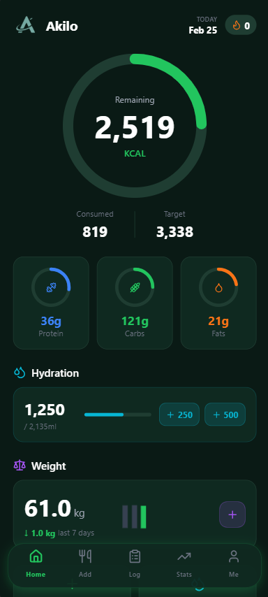
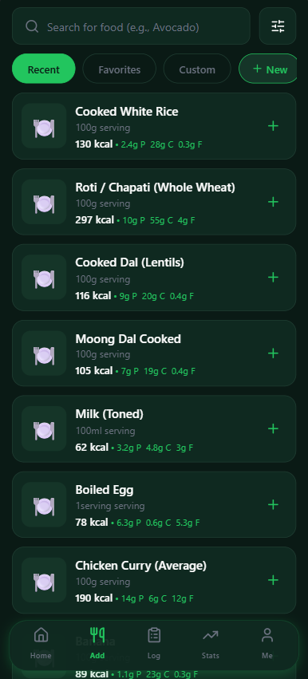
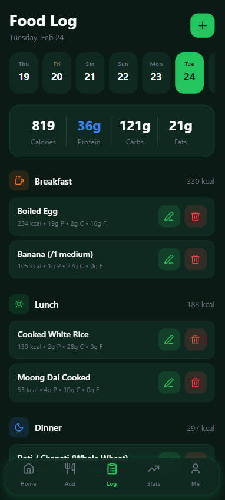
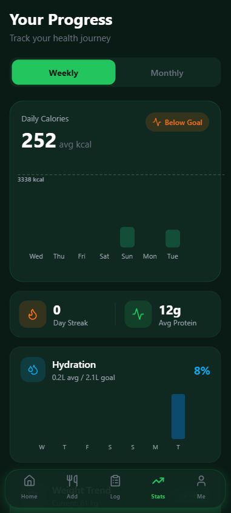
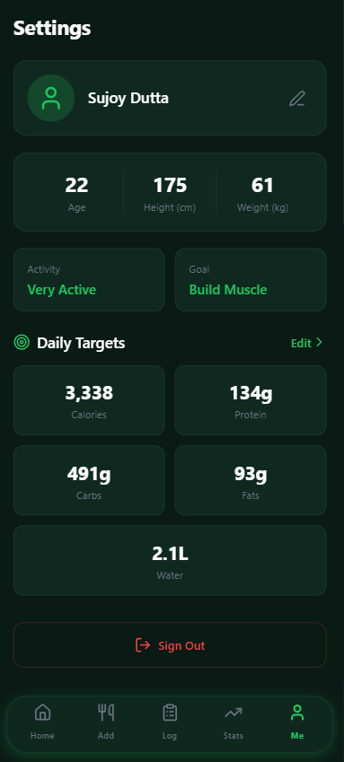
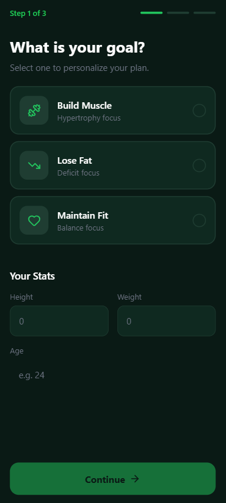

<div align="center">
  
  <h1>Akilo</h1>
  <p><strong>Fitness & Nutrition Tracker</strong></p>
  <p>A open-source mobile app for tracking calories, macros, hydration, and weight — built with React Native and FastAPI.</p>

  [](https://github.com/dutta-sujoy/Akilo)
  [](LICENSE)
  [](https://github.com/dutta-sujoy/Akilo/releases)
  [](https://expo.dev)

  <br/>

  [Features](#-features) · [Screenshots](#-screenshots) · [Tech Stack](#-tech-stack) · [Quick Start](#-quick-start) · [API Docs](#-api-documentation) · [Contributing](#-contributing)
</div>

---

## ✨ Features

| Feature | Description |
|---------|-------------|
| 📊 **Calorie & Macro Tracking** | Log meals with per-serving precision, track protein, carbs, and fats |
| 🔍 **Smart Food Search** | Search from 800+ foods with instant results and favorites |
| 💧 **Water Intake** | Quick-add buttons for hydration tracking with daily goals |
| ⚖️ **Weight Logging** | Track weight over time with trend visualization charts |
| 📈 **Analytics Dashboard** | Beautiful weekly/monthly charts showing your progress |
| 🔥 **Streak System** | Stay motivated with daily logging streaks and badges |
| 🎚️ **Smart Sliders** | Quantity inputs adapt to food type (grams, ml, or servings) |
| 🦴 **Skeleton Loaders** | Smooth animated loading screens for a premium feel |
| 🎨 **Premium Dark UI** | Modern dark theme with smooth animations and glassmorphism |
| 🔐 **Secure Auth** | Supabase authentication with session persistence |
| 🎯 **Personalized Targets** | Set custom calorie, macro, and hydration goals |
| 📱 **Cross-Platform** | Runs on Android and iOS via Expo |

## 📸 Screenshots

<div align="center">
  <table>
    <tr>
      <td align="center"><strong>Dashboard</strong></td>
      <td align="center"><strong>Food Logging</strong></td>
      <td align="center"><strong>History</strong></td>
    </tr>
    <tr>
      <td></td>
      <td></td>
      <td></td>
    </tr>
    <tr>
      <td align="center"><strong>Analytics</strong></td>
      <td align="center"><strong>Profile</strong></td>
      <td align="center"><strong>Onboarding</strong></td>
    </tr>
    <tr>
      <td></td>
      <td></td>
      <td></td>
    </tr>
  </table>
</div>


## 🛠 Tech Stack

<div align="center">

| Layer | Technology | Purpose |
|-------|-----------|---------|
| **Frontend** | React Native + Expo SDK 54 | Cross-platform mobile app |
| **Language** | TypeScript | Type-safe frontend code |
| **Backend** | FastAPI + Python 3.10+ | RESTful API server |
| **Database** | Supabase (PostgreSQL) | Auth, storage, and RLS |
| **Charts** | React Native Gifted Charts | Data visualization |
| **Auth** | Supabase Auth | Secure session management |

</div>

## 🚀 Quick Start

### Prerequisites

- **Node.js** 18+ ([download](https://nodejs.org))
- **Python** 3.10+ ([download](https://python.org))
- **Supabase** account ([free tier](https://supabase.com))
- **Expo Go** app on your phone ([Android](https://play.google.com/store/apps/details?id=host.exp.exponent) / [iOS](https://apps.apple.com/app/expo-go/id982107779))

### 1. Clone & Setup

```bash
git clone https://github.com/dutta-sujoy/Akilo.git
cd Akilo
```

### 2. Database Setup

1. Create a new project at [supabase.com](https://supabase.com)
2. Go to **SQL Editor** → Run the schema from `database/schema.sql`
3. Copy your credentials from **Settings → API**:
   - Project URL
   - Anon/Public Key
   - JWT Secret

### 3. Backend

```bash
cd backend

# Create virtual environment
python -m venv venv
source venv/bin/activate        # macOS/Linux
# venv\Scripts\activate         # Windows

# Install dependencies
pip install -r requirements.txt

# Configure environment
cp .env.example .env
# Edit .env with your Supabase credentials

# Start server
uvicorn main:app --reload --host 0.0.0.0 --port 8000
```

### 4. Frontend

```bash
cd frontend

# Install dependencies
npm install

# Configure environment
cp .env.example .env
# Edit .env with your Supabase credentials and backend URL

# Start Expo
npx expo start
```

### 5. Run on Device

Scan the QR code with **Expo Go** (Android) or **Camera** app (iOS).

> 💡 **Tip:** If same-WiFi doesn't work, use `npx expo start --tunnel` for remote access.

## 🔐 Environment Variables

### Backend (`backend/.env`)

```env
SUPABASE_URL=https://your-project.supabase.co
SUPABASE_KEY=your-anon-key
SUPABASE_JWT_SECRET=your-jwt-secret
```

### Frontend (`frontend/.env`)

```env
EXPO_PUBLIC_SUPABASE_URL=https://your-project.supabase.co
EXPO_PUBLIC_SUPABASE_ANON_KEY=your-anon-key
EXPO_PUBLIC_API_URL=http://YOUR_IP:8000
```

> ⚠️ **Security:** Never commit `.env` files. They are gitignored by default.

## 📁 Project Structure

```
Akilo/
├── backend/                    # FastAPI server
│   ├── app/
│   │   ├── api/endpoints/      # API routes (food, water, weight, analytics)
│   │   ├── core/               # Config, security, dependencies
│   │   ├── db/                 # Database client
│   │   └── models/             # Pydantic schemas
│   └── main.py
│
├── frontend/                   # React Native (Expo) app
│   ├── app/
│   │   ├── (auth)/             # Login, Signup, Onboarding
│   │   └── (tabs)/             # Dashboard, Food, History, Analytics, Profile
│   ├── components/             # SkeletonLoader, Toast, ProgressBar
│   └── core/                   # API client, Supabase config, Theme
│
├── database/
│   └── schema.sql              # Full Supabase schema with RLS policies
│
└── docs/
    └── screenshots/            # App screenshots for README
```

## 📖 API Documentation

Once the backend is running, interactive docs are available at: **`http://localhost:8000/docs`**

| Method | Endpoint | Description |
|--------|----------|-------------|
| `GET` | `/api/profile/` | Get user profile |
| `PUT` | `/api/profile/` | Update profile |
| `GET` | `/api/profile/targets` | Get nutrition targets |
| `PUT` | `/api/profile/targets` | Update nutrition targets |
| `GET` | `/api/food/search?q=` | Search foods |
| `POST` | `/api/food/log` | Log food entry |
| `PUT` | `/api/food/log/{id}` | Edit food entry |
| `DELETE` | `/api/food/log/{id}` | Delete food entry |
| `GET` | `/api/food/favorites` | Get favorite foods |
| `GET` | `/api/food/recent` | Get recent foods |
| `POST` | `/api/water/` | Log water intake |
| `POST` | `/api/weight/` | Log weight |
| `GET` | `/api/analytics/daily?date=` | Daily nutrition summary |
| `GET` | `/api/analytics/weekly?days=` | Weekly analytics data |

## 🤝 Contributing

Contributions are welcome! Here's how to get started:

1. **Fork** the project
2. **Create** your feature branch → `git checkout -b feature/amazing-feature`
3. **Commit** your changes → `git commit -m 'Add amazing feature'`
4. **Push** to the branch → `git push origin feature/amazing-feature`
5. **Open** a Pull Request

## 📄 License

This project is licensed under the **MIT License** — see the [LICENSE](LICENSE) file for details.

---

<div align="center">
  <p>Built with ❤️ by <a href="https://github.com/dutta-sujoy">Sujoy Dutta</a></p>
  <p>
    <a href="https://github.com/dutta-sujoy/Akilo/stargazers">⭐ Star this repo</a> if you found it useful!
  </p>
</div>
